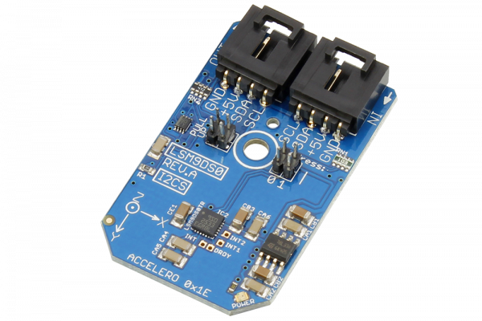

[](https://store.ncd.io/product/lsm9ds0-3d-accelerometer-gyroscope-magnetometer-i2c-mini-module/).

# LSM9DS0

Manufactured by STMicroelectronics, the LSM9DS0 is a system-in-package featuring a 3D digital linear acceleration sensor, a 3D digital angular rate sensor, and a 3D digital magnetic sensor.The LSM9DS0 has a linear acceleration full scale of ±2g/±4g/±6g/±8g/±16g, a magnetic field full-scale of ±2/±4/±8/±12 gauss and an angular rate of ±245/±500/±2000 dps.
This Device is available from www.ncd.io

[SKU: LSM9DS0]

(https://store.ncd.io/product/lsm9ds0-3d-accelerometer-gyroscope-magnetometer-i2c-mini-module/)
This Sample code can be used with Raspberry Pi.

Hardware needed to interface LSM9DS0 3D accelometer,Gyroscope and magnetometer sensor With Raspberry Pi :

1. <a href="https://store.ncd.io/product/lsm9ds0-3d-accelerometer-gyroscope-magnetometer-i2c-mini-module/">LSM9DS0 3D accelometer,Gyroscope and magnetometer sensor</a>

2. <a href="https://store.ncd.io/product/i2c-shield-for-raspberry-pi-3-pi2-with-outward-facing-i2c-port-terminates-over-hdmi-port/">Raspberry Pi I2C Shield</a>

3. <a href="https://store.ncd.io/product/i%C2%B2c-cable/">I2C Cable</a>

## Python

Download and install smbus library on Raspberry pi. Steps to install smbus are provided at:

https://pypi.python.org/pypi/smbus-cffi/0.5.1

Download (or git pull) the code in pi. Run the program.

```cpp
$> python LSM9DS0.py
```
The lib is a sample library, you will need to calibrate the sensor according to your application requirement.
